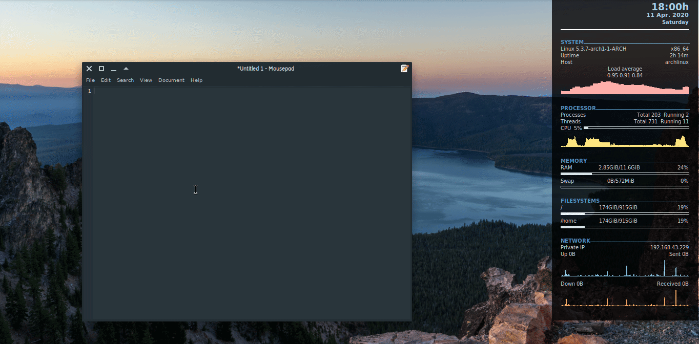

# TypeOnScreen

Youtubers can type their instructions on screen without using a NotPad software. Currenlty only supporting platform is Linux on X11. 

## Screenshot

## Requirements

- GTK3
- libappindicator-gtk3
- libx11

## Installation

### Debian Based Distros

Download debian installation file from [here](https://github.com/whizsid/typeonscreen/releases/download/0.1.0/typeonscreen_0.1.0_amd64.deb) and install it using `sudo dpkg -i ./typeonscreen_0.1.0_amd64.deb` command.

### Make from source

- Install the rust compiler.
- Run `make` and `sudo make install` commands to compile from sources.

### Usage

Run TypeOnScreen from applications menu and press `Ctrl+F6` to toggle typing mode.

## Contribution

Currently only supporting platform is Linux X11. Please contribute to [device_query](https://github.com/ostrosco/device_query) repository if you want to make this work with wayland.

I want to implement this to other operating systems such as Windows, Mac as well.

All PRs and issues welcome and I will reply soon.

And also stars are welcome.